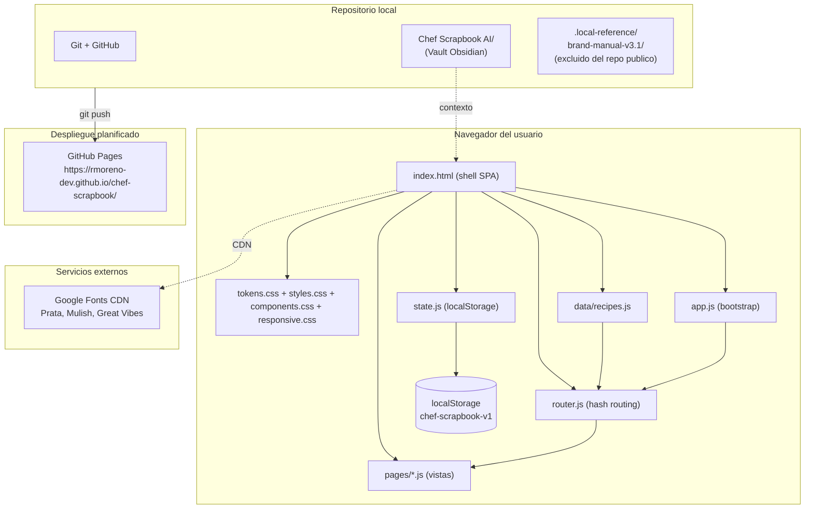
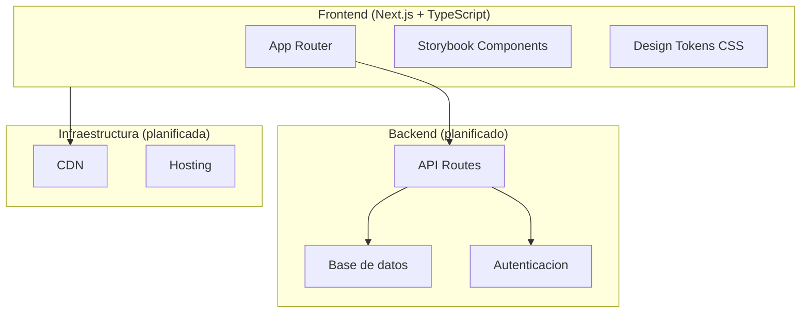

# Arquitectura General

## Diagrama del sistema actual



## Patron de carga de modulos

El shell HTML carga los scripts en orden garantizado:

```
data/recipes.js   → define window.ChefScrapbook.data
state.js          → define window.ChefScrapbook.State
pages/home.js     → define window.ChefScrapbook.Pages.home
pages/recipes.js  → define window.ChefScrapbook.Pages.recipes
pages/recipe-detail.js → define window.ChefScrapbook.Pages.recipeDetail
pages/menus.js    → define window.ChefScrapbook.Pages.menus
router.js         → define window.ChefScrapbook.Router
app.js            → ejecuta bootstrap: initMobileNav() + Router.start()
```

## Componentes actuales

| Componente | Tipo | Descripcion |
|---|---|---|
| `index.html` | Shell SPA | Estructura estatica, punto de montaje `#main-content` |
| `assets/css/tokens.css` | Sistema de diseno | Variables CSS (paleta, tipografia, espaciado, sombras) |
| `assets/css/styles.css` | Estilos globales | Layout, sidebar, cabecera movil, SPA global |
| `assets/css/components.css` | Componentes | Cards, toasts, busqueda, planner, listas |
| `assets/css/responsive.css` | Adaptacion | Breakpoints 320-1440px, sidebar movil |
| `assets/js/data/recipes.js` | Datos | Unica fuente de verdad para el catalogo de recetas |
| `assets/js/state.js` | Estado | Persistencia en localStorage; favoritos, menus, compras, tareas |
| `assets/js/router.js` | Enrutamiento | Hash router: escucha hashchange, resuelve rutas a vistas |
| `assets/js/pages/*.js` | Vistas | Cuatro paginas: home, recipes, recipe-detail, menus |
| `assets/js/app.js` | Bootstrap | Inicializa nav movil, escapeHTML, toast, Calculator, Router |
| `assets/images/favicon.svg` | Branding | Isotipo cat chef (favicon) |
| `assets/icons/*.svg` | Iconografia | 18 iconos SVG del kit oficial de marca |
| `assets/branding/*.svg` | Branding | 4 activos: sello, divisor botanico, sprigs, papel rasgado |
| `Chef Scrapbook AI/` | Vault | Documentacion tecnica y normativa (44 documentos) |
| `.local-reference/` | Referencia local | Paquete de marca v3.1 (no publicado) |

## Separacion de responsabilidades

| Capa | Responsabilidad |
|---|---|
| `index.html` | Estructura HTML semantica, carga de scripts y estilos |
| `data/recipes.js` | Catalogo de recetas, busqueda, filtrado |
| `state.js` | Lectura/escritura en localStorage; API de estado |
| `router.js` | Mapeo hash → vista; manejo de historial |
| `pages/*.js` | Renderizado HTML de cada vista; logica de UI local |
| `app.js` | Funciones globales compartidas; arranque del sistema |

## Separacion aplicacion vs. documentacion

La aplicacion (`index.html` + `assets/`) y el vault documental (`Chef Scrapbook AI/`) son componentes independientes que coexisten en el mismo repositorio. El vault no es parte de la aplicacion publicable.

## Arquitectura futura (PLANIFICADA)

> [!info]
> Lo siguiente es vision del manual v3.1. No existe hoy.



## Documentos relacionados

- [[06_ARQUITECTURA_TECNICA]]
- [[07_STACK_TECNOLOGICO]]
- [[08_ESTRUCTURA_DEL_REPOSITORIO]]
- [[23_CI_CD_Y_DESPLIEGUE]]
