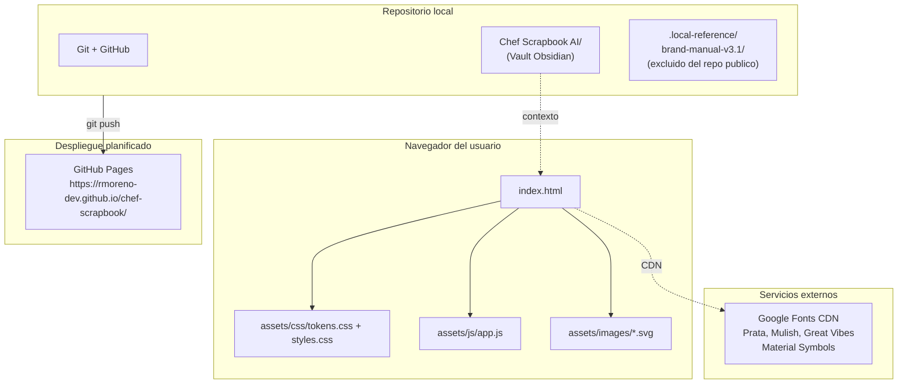
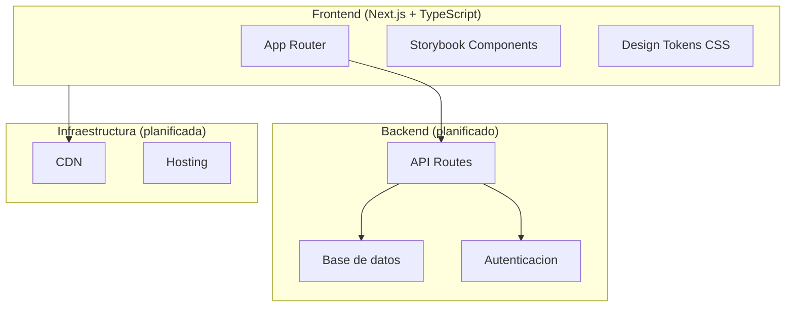

# Arquitectura General

## Diagrama del sistema actual

## Componentes actuales

| Componente | Tipo | Descripcion |
|---|---|---|
| index.html | Aplicacion | Pagina unica estatica |
| assets/css/tokens.css | Sistema de diseno | Variables CSS (paleta, tipografia, espaciado) |
| assets/css/styles.css | Estilos | Componentes y layout |
| assets/js/app.js | Logica | Calculadora de porciones (JS vanilla, IIFE) |
| assets/images/*.svg | Ilustraciones | chef-avatar.svg y chocolate-chip-cookies.svg |
| Chef Scrapbook AI/ | Vault | Documentacion tecnica y normativa |
| .local-reference/ | Referencia local | Paquete de marca v3.1 (no publicado) |

## Separacion aplicacion vs. documentacion

La aplicacion (index.html + assets) y el vault documental (Chef Scrapbook AI) son componentes independientes que coexisten en el mismo repositorio. El vault no es parte de la aplicacion publicable y no debe incluirse en GitHub Pages sin autorizacion expresa.

## Arquitectura futura (PLANIFICADA)

> [!info]
> Lo siguiente es visi ón del manual v3.1. No existe hoy.

## Documentos relacionados

- [[06_ARQUITECTURA_TECNICA]]
- [[07_STACK_TECNOLOGICO]]
- [[08_ESTRUCTURA_DEL_REPOSITORIO]]
- [[23_CI_CD_Y_DESPLIEGUE]]
