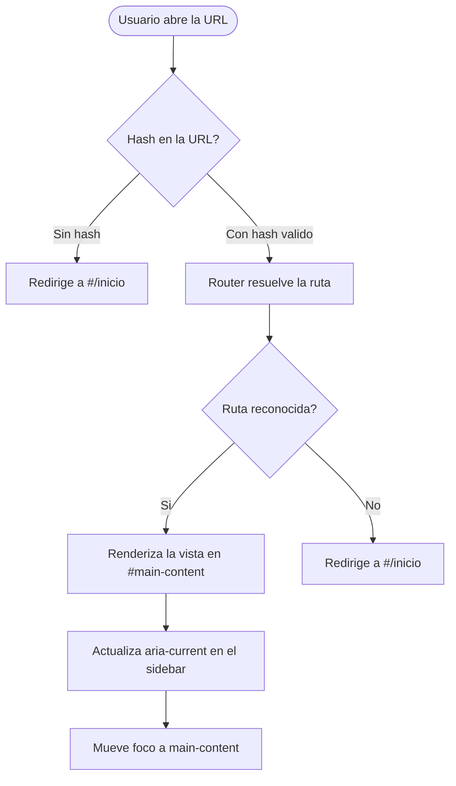
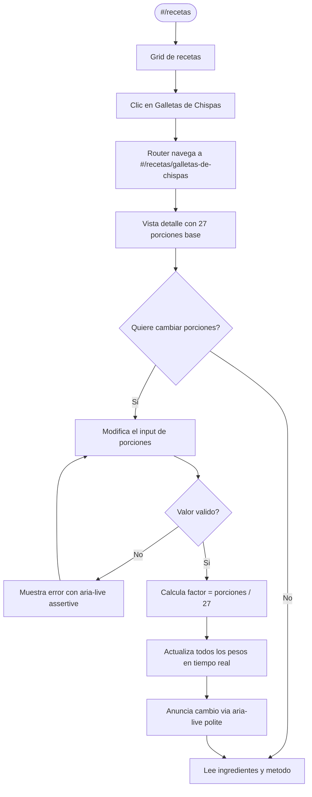
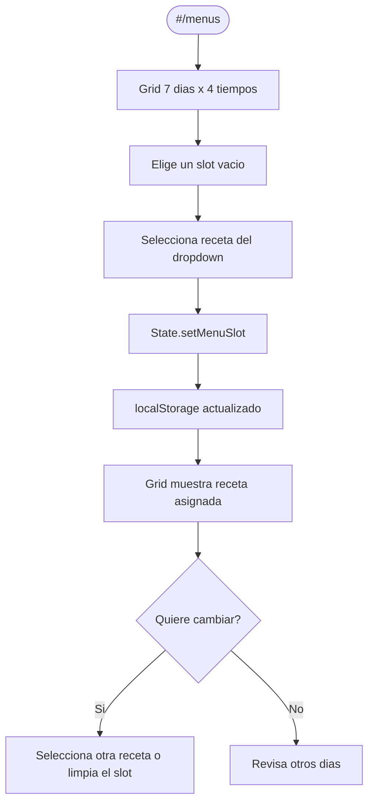
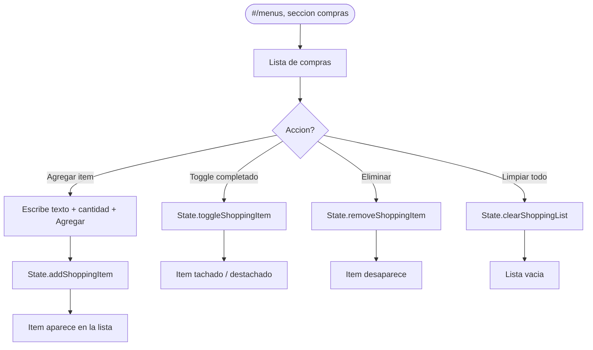
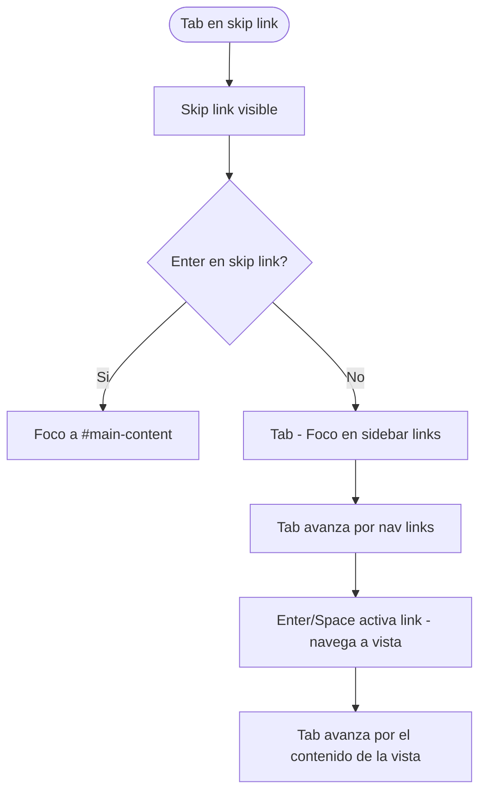
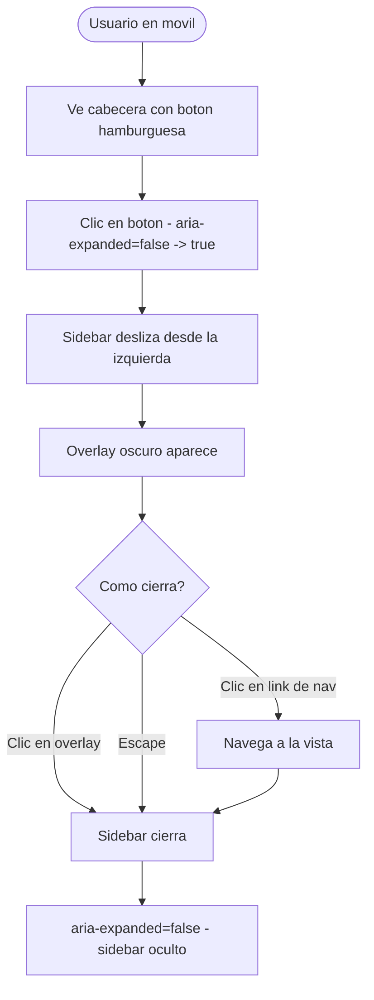

# Flujos de Usuario

## Flujos actuales implementados

### Flujo 1: Navegacion por secciones (SPA)



### Flujo 2: Consultar y escalar receta



### Flujo 3: Marcar/desmarcar favorito

```mermaid
flowchart TD
    A([Vista Recetas o Detalle]) --> B[Ve boton de favorito]
    B --> C{Esta en favoritos?}
    C -->|Si| D[Boton activo - icono relleno]
    C -->|No| E[Boton inactivo - icono vacio]
    D --> F[Clic en boton]
    E --> F
    F --> G[State.toggleFavorite(slug)]
    G --> H[localStorage actualizado]
    H --> I[UI actualizada instantaneamente]
    I --> J[Toast de confirmacion]
```

### Flujo 4: Planificar menu semanal



### Flujo 5: Gestionar lista de compras



### Flujo 6: Navegacion por teclado



### Flujo 7: Sidebar movil



### Flujo 8: Entrada invalida en la calculadora


## Flujos futuros — PLANIFICADO

> [!info]
> Los siguientes flujos estan descritos en el manual v3.1 pero no existen en el codigo.

- Buscar receta por ingrediente o tecnica.
- Registrar version propia de una receta con notas.
- Crear y gestionar cuenta de usuario.
- Exportar receta a PDF.
- Compartir enlace a una receta.
- Visualizar colecciones por temporada o tema.

## Documentos relacionados

- [[09_MODULOS_Y_FUNCIONALIDADES]]
- [[11_FLUJOS_DE_NEGOCIO]]
- [[16_REGLAS_DE_NEGOCIO]]
- [[31_CASOS_DE_PRUEBA]]
