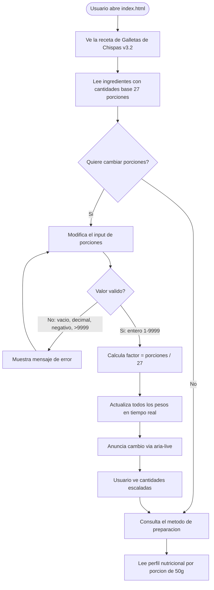
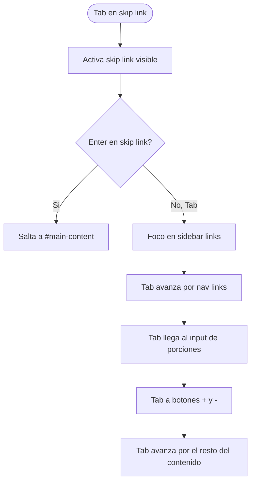
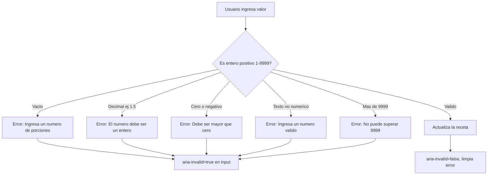

# Flujos de Usuario

## Flujos actuales implementados

### Flujo principal: Consultar y escalar receta

### Flujo: Navegacion por teclado

### Flujo: Entrada invalida

## Flujos futuros — PLANIFICADO

> [!info]
> Los siguientes flujos son descriptos en el manual v3.1 pero no existen en el codigo.

- Buscar y descubrir recetas.
- Guardar una receta en coleccion.
- Crear una coleccion personalizada.
- Registrar version propia de una receta.
- Crear y gestionar cuenta de usuario.
- Exportar receta a PDF.
- Compartir enlace a una receta.

## Documentos relacionados

- [[09_MODULOS_Y_FUNCIONALIDADES]]
- [[11_FLUJOS_DE_NEGOCIO]]
- [[16_REGLAS_DE_NEGOCIO]]
- [[31_CASOS_DE_PRUEBA]]
