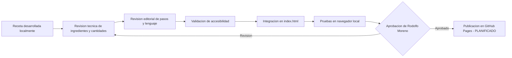

# Flujos de Negocio

## Modelo de negocio actual

**Chef Scrapbook no tiene modelo de negocio comercial activo.**

- No existe transaccion economica.
- El contenido es completamente gratuito.
- No hay pagos, suscripciones ni compras.
- No hay operacion SaaS ni servicio gestionado.
- No hay publicidad ni monetizacion.

## Flujo editorial de una receta (actual)

## Flujo de control de publicacion

1. Desarrollo y prueba local.
2. Revision contra normas del manual v3.1.
3. Verificacion de accesibilidad y responsive.
4. Revision de activos (licencias, alt text).
5. Actualizacion de vault documental.
6. Autorizacion expresa para commit y push.
7. Despliegue en GitHub Pages (cuando este autorizado).

## Flujos futuros (PLANIFICADOS)

> [!info]
> Los siguientes flujos son visiones del manual v3.1 para etapas futuras.

- Flujo de registro y verificacion de cuenta de usuario.
- Flujo de publicacion de receta por colaboradores.
- Flujo de reporte y correccion de error en receta.
- Flujo de exportacion de datos personales (privacidad).
- Flujo de borrado de cuenta.

## Documentos relacionados

- [[10_FLUJOS_DE_USUARIO]]
- [[16_REGLAS_DE_NEGOCIO]]
- [[24_SEGURIDAD]]
